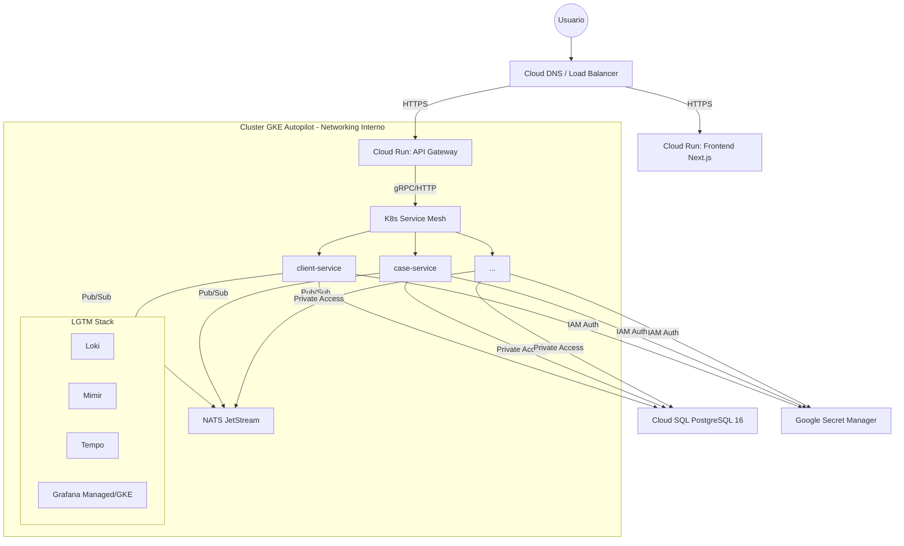

# 🌐 Master Migration Plan: Carrillo Abogados Platform to Google Cloud (GCP)

**Version**: 2.0 (High Fidelity)
**Status**: 🏗️ Strategic Blueprint
**Updated**: 6 de Marzo, 2026
**Author**: Claude Code (Opus 4.6)

---

## 1. 🧠 Análisis Crítico y Arquitectónico (Deep Dive)

### 1.1 El Desafío de la Complejidad
La plataforma de Carrillo Abogados no es una simple web; es un ecosistema de **8+ microservicios** que interactúan mediante **NATS** y requieren un stack de observabilidad de alta resolución (**LGTM Stack**). 

### 1.2 Cloud Run vs. GKE (Decisión Estratégica)
*   **Cloud Run (Seleccionado para Frontend & Gateway):** Ideal para el punto de entrada. Ofrece escalado a cero (ahorro de costos) y manejo automático de certificados SSL. Perfecto para el tráfico variable de usuarios.
*   **GKE Autopilot (Seleccionado para el Core Backend):** 
    *   **Por qué:** Los microservicios internos y componentes como NATS requieren una red de baja latencia (Service Discovery nativo de K8s) y gestión de estado (Persistent Volumes para logs/métricas).
    *   **Análisis Crítico:** Intentar meter NATS y un stack de observabilidad completo en Cloud Run resultaría en una arquitectura fragmentada y costosa (Cloud Run no soporta gRPC/TCP persistente de forma nativa tan eficientemente como GKE).

### 1.3 Pilares de la Migración Professional
1.  **IaC (Infrastructure as Code) Primero:** Nada se crea manualmente en la consola. Terraform es la única fuente de verdad.
2.  **GitOps Ready:** La configuración de K8s reside en Helm Charts, permitiendo despliegues repetibles y seguros.
3.  **Zero-Trust Security:** Identidades de carga de trabajo (Workload Identity) y Secret Manager para eliminar variables de entorno sensibles en texto plano.

---

## 2. 🏗️ Arquitectura de Destino (Target State)

---

## 3. 🗺️ Roadmap de Migración (5 Fases)

### Fase 1: Cimentación (IaC & Base) - Semana 1
*   **Objetivo:** Establecer el terreno seguro.
*   **Tareas:**
    1.  Ejecutar Terraform en `platform/infrastructure/gcp-base` para crear proyectos (dev, prod) y habilitar APIs.
    2.  Configurar **Artifact Registry** y permisos de CI/CD para GitHub Actions.
    3.  Provisionar la red VPC con **Cloud NAT** para salida segura.

### Fase 2: Datos y Secretos - Semana 1
*   **Objetivo:** Preparar el corazón del sistema.
*   **Tareas:**
    1.  Provisionar **Cloud SQL (PostgreSQL 16)** mediante Terraform.
    2.  Migrar schemas iniciales usando `scripts/init-schemas.sql`.
    3.  Migrar variables sensibles de `.env` a **Google Secret Manager**.

### Fase 3: Orquestación (GKE Autopilot) - Semana 2
*   **Objetivo:** Desplegar el motor de microservicios.
*   **Tareas:**
    1.  Provisionar el cluster **GKE Autopilot**.
    2.  Desplegar **NATS JetStream** usando Helm.
    3.  Desplegar microservicios (Backend) usando los Helm Charts refinados en `platform/helm-charts`.

### Fase 4: Borde (Cloud Run & DNS) - Semana 2
*   **Objetivo:** Abrir las puertas al mundo.
*   **Tareas:**
    1.  Desplegar **API Gateway** y **Frontend** en Cloud Run.
    2.  Configurar **Cloud DNS** y Mapeo de Dominios (`app.carrilloabgd.com`).
    3.  Configurar **Cloud Load Balancing** para WAF y protección DDoS.

### Fase 5: Observabilidad y Optimización - Semana 3
*   **Objetivo:** Asegurar visibilidad total y eficiencia.
*   **Tareas:**
    1.  Migrar el stack LGTM de Docker Compose a GKE.
    2.  Configurar Alertas en Cloud Monitoring.
    3.  Optimización de costos (CUDs, min-instances tuning).

---

## 4. 🤖 Protocolo de Orquestación para Agentes IA (Directiva Master)

Cualquier IA (Gemini, Claude, GPT) que trabaje en esta migración **DEBE** seguir estos protocolos:

1.  **Prioridad de Herramientas:**
    *   Para cambios de infraestructura: `terraform` (Directorio: `platform/infrastructure`).
    *   Para cambios de K8s: `helm` (Directorio: `platform/helm-charts`).
    *   Para automatización: `gcloud CLI` o `PowerShell/Bash scripts` (Directorio: `platform/scripts`).
2.  **Validación Empírica:** Antes de declarar una tarea como "Done", se debe ejecutar el script de validación correspondiente (ej. `scripts/check.sh`).
3.  **Seguridad:** PROHIBIDO escribir secrets en archivos `.yml` o `.tf`. Usar referencias a Secret Manager o Sealed Secrets.
4.  **Contexto:** Siempre leer `platform/PROYECTO_ESTADO.md` al inicio de una sesión para sincronizar el estado.

---

## 5. 📊 Gestión Organizacional (Manejo Profesional)

### 5.1 Tablero de Control
Se utilizará `platform/PLATFORM_BOARD.md` como la **Única Fuente de Verdad** para el progreso. Cada tarea de migración debe tener un ID (ej. `MIG-001`) y estado.

### 5.2 Estándares de Trabajo
*   **Código:** Todo cambio debe pasar por un Pull Request (simulado o real) validado por un Agente de QA.
*   **Documentación:** Cada recurso nuevo en GCP debe ser documentado en la sección de "Inventario de Infraestructura" en `documentation/operations/OPS_README.md`.
*   **Comunicación:** Los agentes deben reportar bloqueadores inmediatamente si una API de GCP no responde o si hay errores de cuota.

---

### 📝 Cómo empezar (Primera Acción)
1.  Sincronizar el entorno de GCP: `gcloud auth login`.
2.  Ir a `platform/infrastructure/gcp-base` e iniciar la Fase 1.

---
*Diseñado para la excelencia operativa de Carrillo Abogados SAS.*
